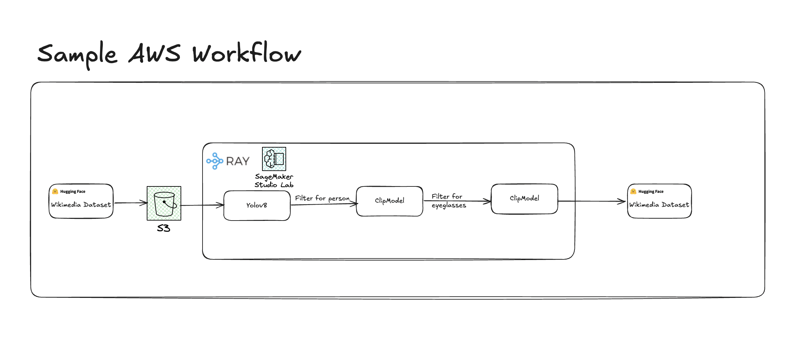

# Eyeglasses Detection Pipeline

A distributed image processing pipeline that detects faces and identifies people wearing eyeglasses in images. 



## Overview

This project implements an end-to-end pipeline for processing images to detect people wearing eyeglasses. It uses:

- **YOLO** for face detection
- **CLIP** for eyeglass identification
- **Ray** for distributed processing

## Project Structure

- `src/data.py`: Downloads dataset files from Huggingface
- `src/model.py`: Contains the `ImageClassifier` class that processes images
- `src/inference.py`: Implements distributed offline batch infererence using the Ray Framework
- `src/load.py`: Uploads processed data to Huggingface

## Installation

```
git clone https://github.com/maneel1995/stabilitydehw.git
cd stabilitydehw
pip install -r requirements.txt
```

## Getting Started

### Downloading data
This project uses the Wikimedia WIT dataset from Huggingface:

```bash
python src/ddata.py --full False --workers 4
```
Options:
- `--full`: Downloads the full dataset (330 files) if True, or just 2 files
- `--workers`: Number of parallel download threads (default:4)

The download process uses ThreadPoolExecutor for parallel downloads. 

### 2. Running Inference

Process the downloaded parquet files with the pipeline:

```bash
python src/inference.py --concurrency 3 --batch_size 16
```

Options:
- `--concurrency`: Number of concurrent inference workers (default: 1)
- `--batch_size`: Batch size for inference (default: 5)

This will process all images, detect faces, classify whether they contain people wearing eyeglasses and save the result to parquet files. Using the Ray framework means that we can scale this process to billions of images with data in disk and in a distributed cluster. 

### 3. Upload Results to Huggingface 

```bash
python src/load.py --repo_id your-username/image_predictions --output_dir data/output
```

Options:
- `--repo_id`: Target Huggingface dataset repo name
- `--output_dir`: Path to the output directory with parquet files (default: data/output/)
- `--public`: Make dataset public (default is private)

### Model Architecture

The pipeline uses two models:

1. **Yolov8 Face Detection**: Detects faces in images with bounding boxes
    - Pre-trained model from Huggingface(arnabdhar/YOLOv8-Face-Detection)
    - Used for its speed and accuracy in detecting human faces

2. **CLIP**: CLassifies whethere detected faces are wearing eyeglasses. Extremely flexible 
    - Pre-trained model from OpenAI(openai/clip-vit-base-patch32)
    - Leverages zero-shot classification capabilities through carefully crafted text prompts

### Architecture Choices
#### YOLOv8 for Person Detection
- Used as the first filter to check if an image contains a person.
- Chosen for its speed, accuracy, and ability to run batch inference.

#### CLIP for Semantic Filtering
- **Second filter**: Confirms the detected object is indeed a person.
- **Third filter**: Checks if the person is wearing eyeglasses.
- CLIP is preferred over **MTCNN** and **Haarcascade** due to better performance on small, diverse datasets.
- Supports **prompt tuning** (e.g., “a person wearing eyeglasses”) for improved precision.

#### Ray for Distributed Processing
- Enables fast and scalable processing across multiple nodes.
- Ideal for batch inference on billions of records.

#### 📊 Final Output
- **105 images** identified with people wearing eyeglasses across the first two partitions. Approximate 15 images of the 105 have been manually identified to be False. For the first two partitions,a manual overview of 1284 persons identified through the first YoloModel indicate that there are approximately 124 images of people with spectacles. This shows:-

- **Precision** :90/105 = 85.74%
- **Recall** *:90/124 = 72%

  *-> This indicates that the Yolo Model has 100% accuracy of identifying persons. 

### Architecture Tradeoffs
- **MTCNN** and **HaarCascade** (OpenCV):
  - Easier to implement.
  - Poor performance on real-world, noisy images.
  - High rate of false positives, especially for eyeglass detection.

- **LBP Classifiers** (OpenCV):
  - Can be run in parallel.
  - Similar limitations to HaarCascade in terms of reliability.

- **CLIP Model Tradeoffs**:
  - Provides better semantic understanding via prompt tuning.
  - Increasing CLIP's confidence threshold improves precision but may miss some valid cases.
  - Additional prompt tuning (e.g., `"a person wearing spectacles"`, `"man with glasses"`) could improve accuracy further.

- **Vision Transformers (ViT)**:
  - More powerful alternatives like ViT could have been explored.
  - Potentially higher accuracy, but with increased computational cost.

- **General Tradeoff**:
  - Most models struggle with false detections.
  - Raising confidence cutoffs helps reduce false positives but may lower recall.


### Dataset 

The dataset can be found at [maneel/peoplewitheyeglasses](https://huggingface.co/datasets/maneel/peoplewitheyeglasses)